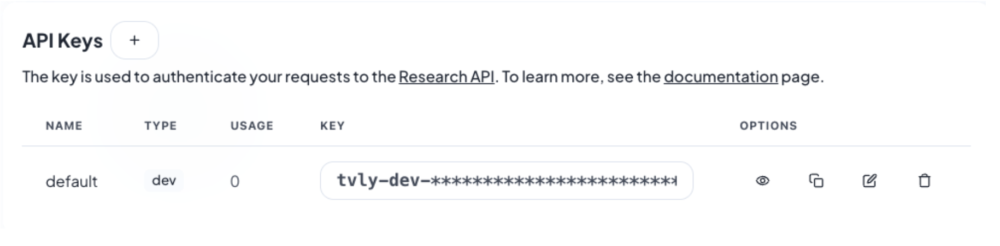
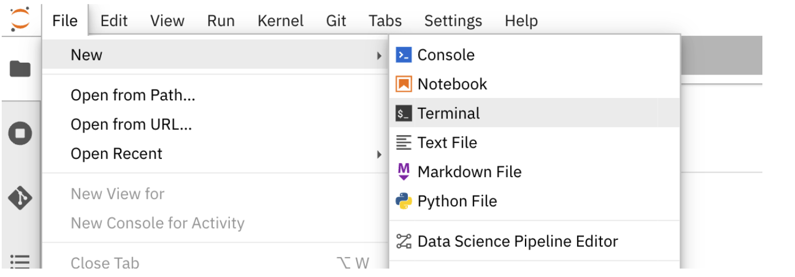
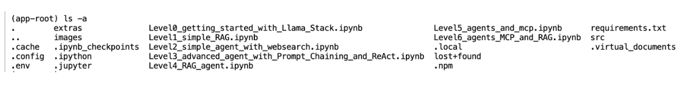
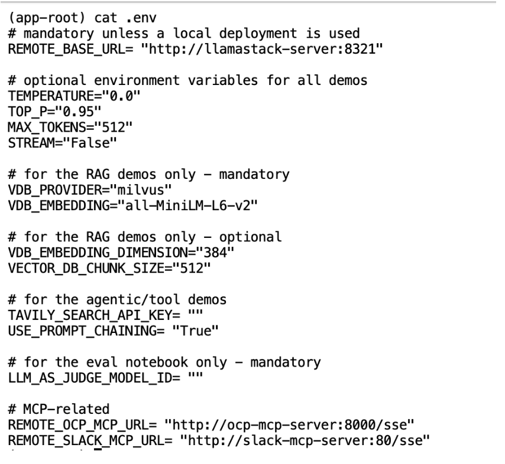
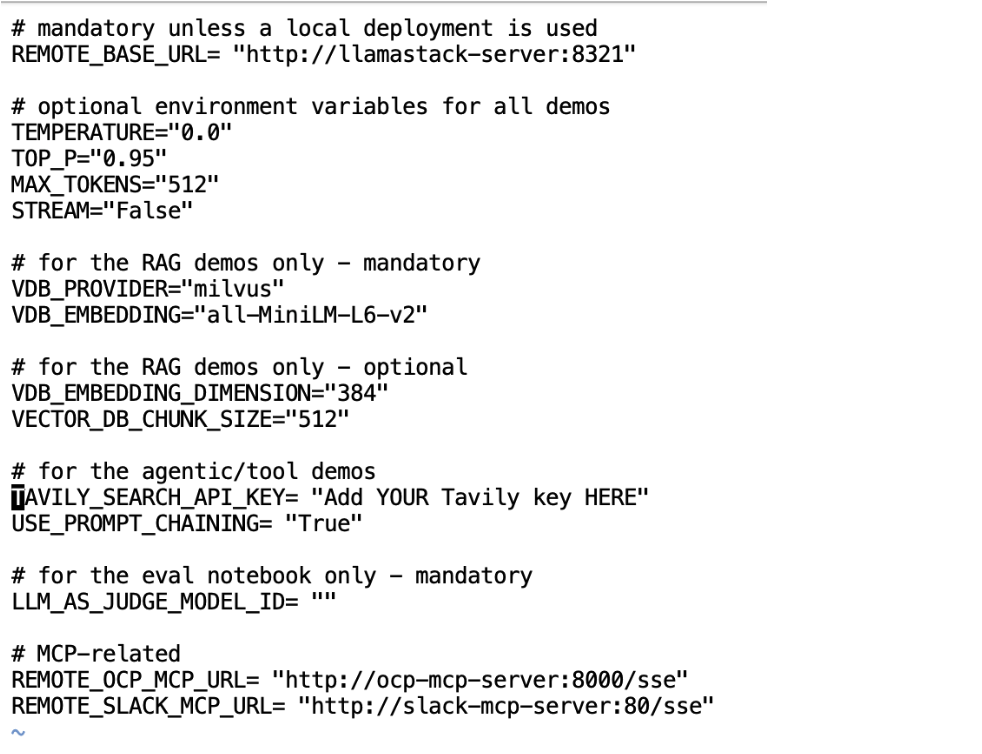
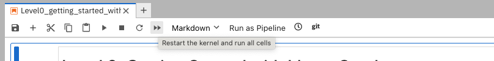

= Level 0 - Setting up the environment

Before starting the demo, it's essential to execute the Level 0 notebook to configure your environment. This includes tasks such as installing necessary packages and setting up environment variables using the `.env` file.

image::../assets/images/level0.png[Level 0 - Setting up the environment]

=== Tavily key

For running some of these notebooks, you will need a Tavily key. 
Go to https://tavily.com/ and register for a free account. This is needed to enable the Llama Stack built-in web search tool. 
Once logged in, access the `Overview` section where you will find your default API key listed under `API keys`. Copy this API key and store it securely as it will be used to configure your environment variables later in this tutorial. Ensure that the copied key is an exact match to avoid any issues.

=== Add your Tavily key to .env

We will now add the Tavily key to our `.env` file. Once you have obtained your Tavily key, go back to your Jupyter workbench and navigate to `File -> New -> Terminal` to open a terminal window within the workbench.

Next, run `ls -a` to show all the files under the current directory, including the hidden files like `.env` which stores our environment variables.

Lets use `cat .env` to look at what’s inside this file. We have set all the default environment variables as follows:

Next, we need to update this file via the `vi .env` command to add your Tavily key. Once opened, type `i` to edit the file. Update `TAVILY_SEARCH_API_KEY` with your api key.

After editing, hit the `esc` key on your keyboard to exit from insert mode, and type `:wq` to save and exit.
Now we are ready to run the notebook!

== Run Notebook 0

To execute the notebook cells, navigate to the top toolbar. Click the fast-forward (⏩) icon to restart the kernel and execute all cells sequentially from top to bottom.

