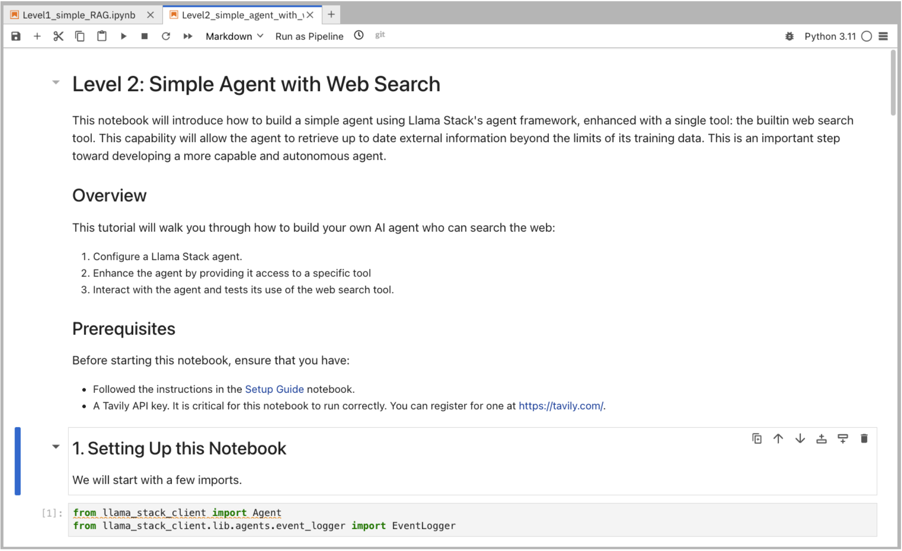

= Level 2: Simple Agent with Web Search

In this notebook, we will be building a simple web search agent using Llama Stack.

== Learning Objectives

* *Understand how to equip an agent* with Llama Stack’s built-in tools, specifically web search
* *Utilize tools to fulfill user requests*
* *Grasp the basic architecture of an agent framework and the concept of tool invocation*

== Run Notebook 2

To run this notebook, please select `Level2_simple_agent_with_websearch.ipynb` from the file browser.

To execute the notebook cells, navigate to the top toolbar. Click the fast-forward (⏩) icon to restart the kernel and execute all cells sequentially from top to bottom.

image::../assets/images/run_notebook.png[Run Notebook]