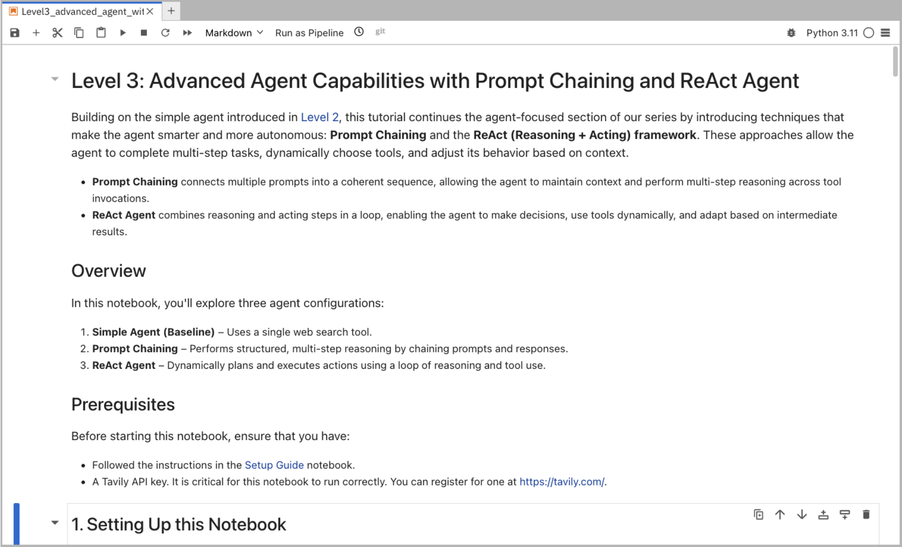

= Level 3: Advanced Agents with Prompt Chaining & ReAct

In this notebook, we will be using Llama Stack to build an advanced agent with prompt chaining and ReAct functionalities.

== Learning Objectives

* *Understand how to build agents that are capable of complex reasoning through prompt chaining*
* *Employ the ReAct framework for structured action planning*
* *Learn how to integrate effective prompt chains for multi-turn interactions*

== Running Notebook 3

To run this notebook, please select `Level3_advanced_agent_with _Prompt_Chaining_and_ReAct.ipynb` from the file browser.

To execute the notebook cells, navigate to the top toolbar. Click the fast-forward (⏩) icon to restart the kernel and execute all cells sequentially from top to bottom.

image::../assets/images/run_notebook.png[Run Notebook]