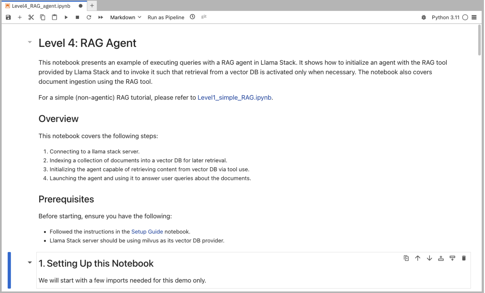

= Level 4: Agentic RAG

In this notebook we will be building a RAG agent using Llama Stack.

== Learning Objectives

* *Understand how to define and implement Retrieval Augmented Generation (RAG) within an AI agent framework*
* *How to enable agents to autonomously decide when to use RAG and when to answer questions directly*

== Run Notebook 4

To run this notebook, please select `Level4_RAG_Agent.ipynb` from the file browser.

To execute the notebook cells, navigate to the top toolbar. Click the fast-forward (⏩) icon to restart the kernel and execute all cells sequentially from top to bottom.

image::../assets/images/run_notebook.png[Run Notebook]