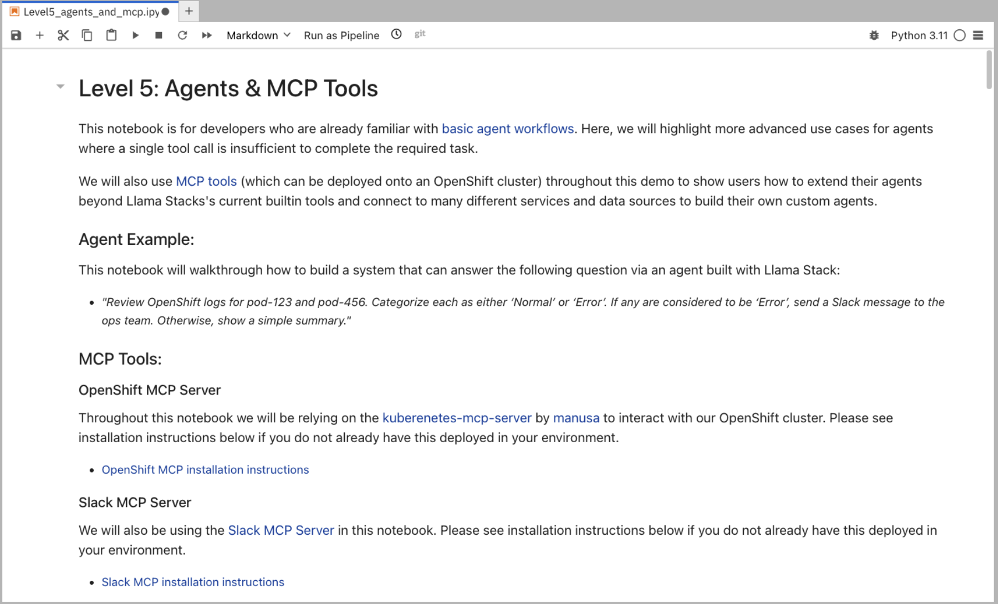

= Level 5: Agentic and MCP

In this notebook, we will be building an advanced agent using Llama Stack that interacts with multiple external MCP tools.

== Learning Objectives

* *Understand how to build and utilize agents that can interact directly with any external system by leveraging MCP tools.*

== Slack Pre-Requisite

We will be interacting with a Slack MCP server in this notebook for which you will need to join the public Slack channel workspace using this invite link: https://join.slack.com/t/octo-emerging-tech/shared_invite/zt-35pmx4q0i-OFwWNE6nIcPEmbM7YS55yg

Once logged into the workspace make sure to join the link:https://app.slack.com/client/T08M9UTL2DC/C08MUDSNHED[#demos] channel.

== Run Notebook 5

To run this notebook, please select `Level5_agents_and_mcp.ipynb` from the file browser.

To execute the notebook cells, navigate to the top toolbar. Click the fast-forward (⏩) icon to restart the kernel and execute all cells sequentially from top to bottom.

image::../assets/images/run_notebook.png[Run Notebook]